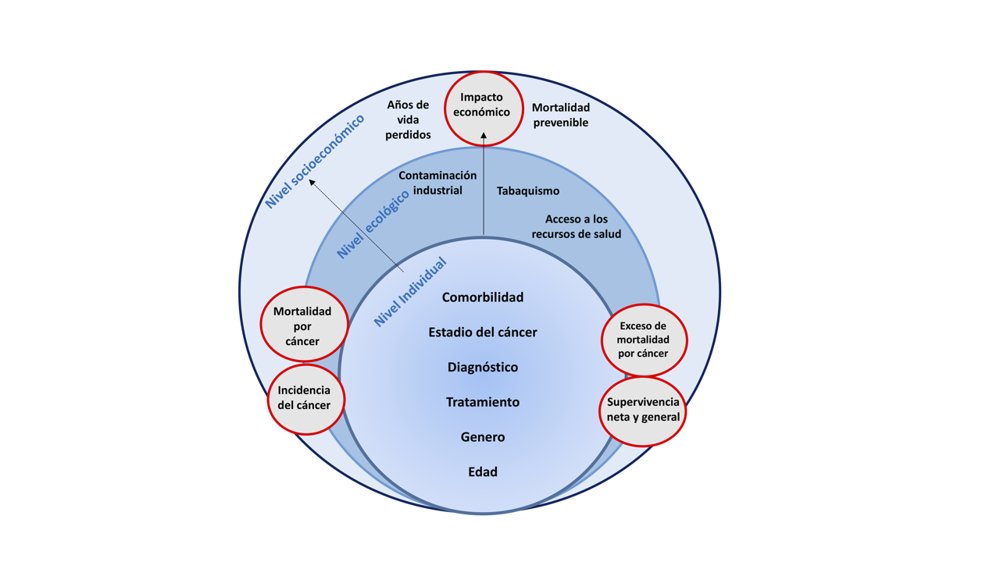
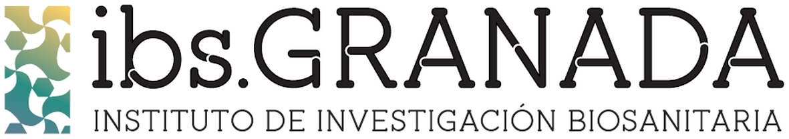
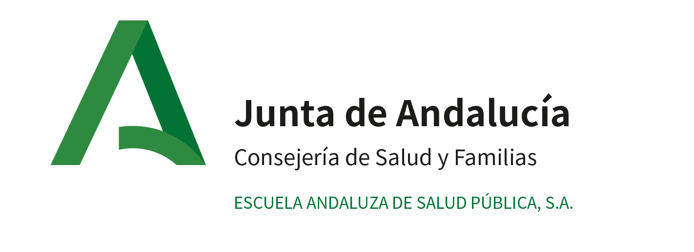

# Estudio Poblacional Multinivel de las Desigualdades Socioeconómicas en la Distribución Geográfica de la Incidencia, la Mortalidad y la Supervivencia Neta del Cáncer en España  

## Proyecto DESOCANES (FIS PI18/01593)

# Resumen 
La incidencia de cáncer está aumentando a nivel mundial debido fundamentalmente al envejecimiento de la población. Los registros del cáncer de base poblacional son un recurso de salud pública esencial para la vigilancia epidemiológica y el control del cáncer. La incidencia y la mortalidad brindan información sobre la carga de la morbilidad del cáncer y los años potenciales de vida perdidos debidos al cáncer, mientras que la supervivencia es un indicador general de la efectividad del sistema sanitario. En los países del norte de Europa existe una larga tradición de caracterización de las desigualdades socioeconómicas a nivel geográfico, usando índices de privación. En el Reino Unido los pacientes de cáncer que viven en áreas más ricas presentan una mayor supervivencia del cáncer que los que viven en zonas más desfavorecidas. Sin embargo, en España no es habitual documentar geográficamente las desigualdades socioeconómicas en salud. Es por esta razón, que recientemente se han desarrollado el Índice Europeo de Privación (EDI) y el Índice de Privación 2011 (IP2011) como medidas estandarizadas para medir la privación socioeconómica en el sur de Europa a nivel de las secciones censales (small areas). El principal objetivo de **DESOCANES** es caracterizar las desigualdades socioeconómicas en la incidencia, el exceso de mortalidad, la mortalidad prematura y la supervivencia neta para tres de los cánceres más incidentes (pulmón, colon-recto y mama) en España usando el EDI y el IP2011. Este estudio nacional de base poblacional evaluará el impacto de las desigualdades socioeconómicas, utilizando métodos epidemiológicos de vanguardia que incluyen el análisis espacial, la modelización multinivel, la supervivencia neta y la evaluación del impacto económico. La identificación y caracterización de estas desigualdades socioeconómicas en España puede tener importantes implicaciones en la organización, la provisión de servicios y en la atención médica del cáncer minimizando el impacto de la “epidemia” del cáncer en España. 

# Abstract
The incidence of cancer is increasing worldwide due mainly to the ageing of the population. Population-based cancer registries are an essential public health resource for epidemiological cancer surveillance and control. Incidence and mortality provide information on the burden of cancer morbidity and the potential years of life lost due to cancer, while survival is a general indicator of the effectiveness of the health system. In northern European countries there is a long tradition using ecological indices of deprivation to characterize socioeconomic inequalities at a geographical level. For instance, in the United Kingdom cancer patients living in wealthier areas have a higher cancer survival than those living in more deprived areas. However, in Spain there is no supporting evidence showing socioeconomic inequalities in cancer outcomes. It is for this reason that the first Spanish Deprivation Index (IP2011) and the European Deprivation Index have recently been developed as a standardized measure to measure socio-economic deprivation in southern Europe at the census level. The main objective of **DESOCANES** is to characterize socioeconomic inequalities in incidence, excess mortality, premature mortality and net survival for three of the most incidental cancers (lung, colon-rectum and breast) in Spain using a specific deprivation index for three of the most incident cancer sites (breast, lung and colorectal). We will develop a national population-based study to assess the impact of socioeconomic inequalities on cancer, using state-of-the-art epidemiological methods that include spatial analysis, multilevel modeling, net survival, and an economic impact assessment. The identification and characterization of cancer socioeconomic inequalities and the associated determinants could have important implications for the organization and the provision of services in cancer medical care, minimizing the impact of the cancer "epidemic" in Spain.

###### Figura 1. Objetivos del proyecto DESOCANES

###### Figure Copyright: Miguel Angel Luque-Fernandez 

### Objetivo principal

Caracterizar las desigualdades socioeconómicas en:
		
- la incidencia

- el exceso de mortalidad

- la mortalidad prematura

- la supervivencia

para los cánceres de **colon-recto**, **pulmón** y **mama** en España.

### Objetivos secundarios

- Investigar las variaciones en **incidencia** y **mortalidad** en España según los niveles de desigualdades económicas basadas en un índice de privación.

- Investigar las variaciones en **exceso de mortalidad** por cáncer, **supervivencia general y neta** (1, 2, 3, 5 años), **mortalidad prematura** (1, 3, 6 meses tras el diagnóstico) y **años de vida perdidos** según los niveles de desigualdades económicas basadas en un índice de privación.

- Estudiar la **carga económica del cáncer** en términos de costes y ganancias en salud, medido como número de muertes prematuras evitables y años de vida perdidos por cáncer.

---------------------

## Material docente y tutoriales 

### I Datos espaciales en salud (28-30 de Noviembre, 2018)

Curso presencial organizado por el Centro Nacional de Epidemiología, la Escuela Andaluza de Salud Pública y CIBERESP. 

[Programa](/material_docente/programa_cne.pdf)  

#### Recursos:  

**1. Introducción a los Sistemas de Información Geográfica**    
[Presentación](/material_docente/presentacion_DRS_cne.pdf)   

**2. Introduction to Spatial Epidemiology Analyses and Methods**   
[Presentación](/material_docente/presentacion_MALF_cne.pdf)      

### II Net Survival Estimation (27-28 de Marzo, 2017)    
Curso presencial organizado por la Escuela Andaluza de Salud Pública en colaboración con la London School of Hygiene and Tropical Medicine.  

**3. [Acceso a el material docente](https://github.com/migariane/EASP_NET_SURV/tree/v.1)**  
**4. [Tutorial online: Net Survival Cohort approach](http://migariane.github.io/Cohort.html)**  

### III Curso introductorio de análisis de supervivencia  

**5. [Acceso a el material docente](https://github.com/migariane/SVA-ULB)**  
**6. [Tutorial online con ejercicios](http://migariane.github.io/Tutorial-SVA-ULB.html)**  

### IV Distribuciones paramétricas de supervivencia  
**7. [Acceso a la aplicación interactiva](https://watzilei.com/shiny/Pardist/)**  

---------------------

## Artículos y trabajo en curso

- En colaboración con el **Centro Nacional de Epidemiología** del Instituto de Salud Carlos III se está desarrollando una aplicación informática para la georreferenciación de los casos incidentes de cáncer en España en el marco del Subprograma de Vigilancia del Cáncer del CIBERESP.

- Recientemente hemos georreferenciado todos los casos incidentes de cáncer colorrectal de la provincia de Granada durante el período 2011-2013 y estamos estudiando la asociación entre los quintiles del IP2011 y la supervivencia a 10 años del cáncer colorrectal. 

- En este enlace se irán actualizando los artículos y actividades derivadas del proyecto FIS PI18/01593

---------------------

## Congresos y Jornadas

- "Descarga de datos del Instituto Nacional de Estadística con R usando el servicio API JSON",
Daniel Redondo Sánchez, Miguel Ángel Luque Fernández, Miguel Rodríguez Barranco, Pablo Fernández-Navarro, María José Sánchez Pérez. **XI Jornadas de Usuarios de R** http://r-es.org/XIjuR/  
- [Abstract](/INE_R_Abstract.pdf)  

---------------------

## Ciencia reproducible (repositorio GitHub)

Recientemente un [grupo de trabajo sobre los determinantes sociales de la salud](https://www.seepidemiologia.es/gruposdetrabajo.php?contenido=gruposdetrabajosub6) de la sociedad española de epidemiología ha desarrollado un índice de Privación (IP2011). El IP2011 es una medida del grado de privación socioeconómica de las secciones censales del Estado Español en 2011. El IP2011 combina información de seis indicadores socioeconómicos (básicamente empleo y educación), calculados para cada sección censal a partir de los datos recogidos en el Censo de Población y Viviendas de España de 2011 (**Cita -provisional-**: Duque I, Domínguez‐Berjón MF, Cebrecos A, Prieto‐Salceda MD, Esnaola S, Calvo Sánchez M, Marí‐Dell’Olmo M. Índice de privación en España por sección censal en 2011: hacia un seguimiento de la desigualdad en áreas pequeñas durante la crisis económica.)

Basado en el IP2011, hemos realizado un [mapa interactivo](https://github.com/danielredondo/Deprivation-maps-in-Spain) de los quintiles de privación en España a nivel censal basado en código abierto y reproducible en R donde se puede apreciar un particular patrón en la distribución de la privación a nivel de las secciones censales en España 2011.

---------------------

## Equipo de Investigación

### IP: **Miguel Ángel Luque Fernández, MA, MPH, MSc, PhD**
Senior Scientific Researcher of Epidemiology and Biostatistics  
Miguel Servet I (CP17/00206-EU/FEDER) at Instituto de Investigación Biosanitaria de GRANADA (ibs.GRANADA, University of Granada, Granada, Spain) and Biomedical Network Research Centers of Epidemiology and Public Health (CIBERESP), ISCIII, Madrid, Spain.   
[Academic website](https://maluque.netlify.com/)  

Assistant Professor of Epidemiology and Biostatistics (Honorary)  
Department of Non-Communicable Disease Epidemiology  
London School of Hygiene and Tropical Medicine, London, UK.   
[LSHTM academic website](http://www.lshtm.ac.uk/aboutus/people/luque.miguel-angel)  

Scientist collaborator, Department of Epidemiology  
Harvard TH Chan School of Public Health, Boston, USA.  
[Harvard academic website](https://scholar.harvard.edu/malf)  

CoMcOR study and tutorials  
[CoMcOR study](https://comcor.netlify.com/)  
[Tutorials](http://migariane.github.io/)  

  miguel.luque.easp at juntadeandalucia.es

### CO-IP: **María José Sánchez Pérez, MD, PhD**
Directora del Registro de Cáncer de Granada. Profesora de la Escuela Andaluza de Salud Pública. Licenciada en Medicina y Cirugía, Especialista en Microbiología y Parasitología Clínica y Experta en Epidemiología e Investigación Clínica por la Universidad de Granada.

[Registro de Cáncer de Granada](http://cancergranada.org/es/index.cfm)

### Personal investigador contratado: 

- **Daniel Redondo Sánchez, MSc**  
Daniel es matemático y experto en Epidemiología e Investigación Clínica por la Universidad de Granada.
Trabaja en el Instituto de Investigación Biosanitaria de GRANADA (ibs.GRANADA), la Escuela Andaluza de Salud Pública y CIBERESP.  

### Investigadores colaboradores:

- **Loreto Vilardell**    
Loreto es licenciada en medicina por la Universidad de Navarra y especialista en Medicina Preventiva y Salud Pública, con amplia experiencia en epidemiología del cáncer de base poblacional. Trabaja como adjunto especialista en la “Unitat d’Epidemiologia i Registre de Càncer de Girona”.    

- **Marcela Guevara Eslava**  
Marcela es doctora en medicina por la Universidad de Navarra y Máster en Salud Pública por la Escuela Nacional de Sanidad. Es Facultativo Especialista de Área de Medicina Preventiva y Salud Pública en el Instituto de Salud Pública de Navarra, con gran experiencia investigadora en el área de epidemiología del cáncer y en los estudios de alta resolución. Es investigadora del CIBERESP.    

- **Marià Carulla Aresté**  
Marià es licenciado en Medicina por la Universidad de Barcelona. Desde 2010 trabaja en el Registro de Cáncer de Tarragona, con experiencia acreditada en estudios epidemiológicos y publicaciones científicas sobre cáncer (incidencia, mortalidad y supervivencia de base poblacional).  

- **Rosario Jiménez**  
Rosario es diplomada en enfermería y profesora asociada de Salud Pública en la Facultad de Enfermería de la Universidad de Castilla la Mancha. Cuenta con gran experiencia en el ámbito de la investigación en Salud pública y trabaja en el Registro de Cáncer de Cuenca.    

- **Fernando Almela Vich**  
Fernando es doctor en Salud Pública y trabaja como médico en la Dirección general de Salud Pública de la Conselleria de Sanitat de la Comunitat Valenciana. Actualmente es el responsable del Registro de Cáncer de Castellón.   

- **Arantza López de Munain Marqués**  
Arantza es licenciada en Biológicas por la Universidad del País Vasco. Desde el año 2013 trabaja como técnico de Epidemiología en el registro de Cáncer del País vasco, habiendo participado en algunas actividades relacionadas con la epidemiología del cáncer de ámbito poblacional.  

- **Antonia Sánchez Gil**  
Antonia es licenciada y coordinadora del Registro del Cáncer de Murcia.  

- **Olivier Nuñez**  
Olivier es doctor en Estadística y Cálculo de Probabilidades por la Université Paul Sabatier con experiencia internacional en epidemiologia espacial del cáncer, modelos Bayesianos jerárquicos y geocodificación. Trabaja en el Centro Nacional de Epidemiología, en el grupo liderado por Marina Pollán.    

- **Miguel Rodriguez-Barranco**  
Miguel es estadístico y doctor por la universidad de Granada con amplia experiencia es análisis bioestadísticos, epidemiologia medioambiental y del cáncer de base poblacional. Actualmente es el coordinador de la investigación del Registro de cáncer de Granada, investigador de CIBERESP y de ibs.Granada.  

- **Jaime Espín Balbino**  
Es Profesor de la Escuela Andaluza de Salud Pública (Granada). Doctor en Economía, Licenciado en Derecho y Máster en Economía de la Salud. Es especialista en la evaluación económica y en el estudio de las políticas de gasto farmacéuticas. Gran experiencia en la coordinación de proyectos europeos, algunos de ellos, relacionados con cáncer. Es investigador de CIBERESP y de ibs.GRANADA.    

---------------------

Carlos III Institute of Health, Grants/Award Numbers: PI18/01593 & CP17/00206-EU/FEDER

---------------------

---------------------

 

 

 

  

